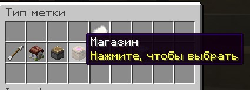

## ТЗ плагинов для VoxelCraft

### 1. Плагин на метки

Чтобы не приходилось запоминать координаты всех порталов в аду — нужен этот плагин 

#### Меню меток
При вписании команд /point или /p выводилось GUI меню с подобмным функционалом

Внимание метки должны быть пронумерованны с 1 до бесконечности для следующего плагина

Примечание метки можно создавать только в аду

Поиск меток работает вот так

----

#### Работа создания меток

Добавить разновидности меток как тут

---

#### После всех действий выходит это GUI меню
Функционал показан на скринах ниже

После чего в настройках метки появляется действи "Удалить метку"

---

### 2. Плагин на показ координат

При вводе команды :loc: показывает твои координаты на данный момент
Так же добавить обозначени координат по типу: верхний мир, нижний мир, энд

метки в чат. Например: :p1:, :п1: Работает как на русском, так и на английском. Вместо 1 вводить любой номер метки

Показать предмет, который вы держите в руке, через :item:

----

### 3. Плаги на настройку чата

Команда /chat открывает GUI с настройками чата

Далее функционал:
Можно включить/отключить сообщения о входе/выходе, глобальный чат, сообщения о смерти, достижения, личные сообщения, звуковые уведомления и фильтр бан-вордов или матов для стримеров

----

### 4. Плагин на мир ферм
Нужно чтобы при вводе команды /farm происходил коннект на другой сервер, так же и наоборот при вводе комманды /build происходил коннект обратно на основной сервер